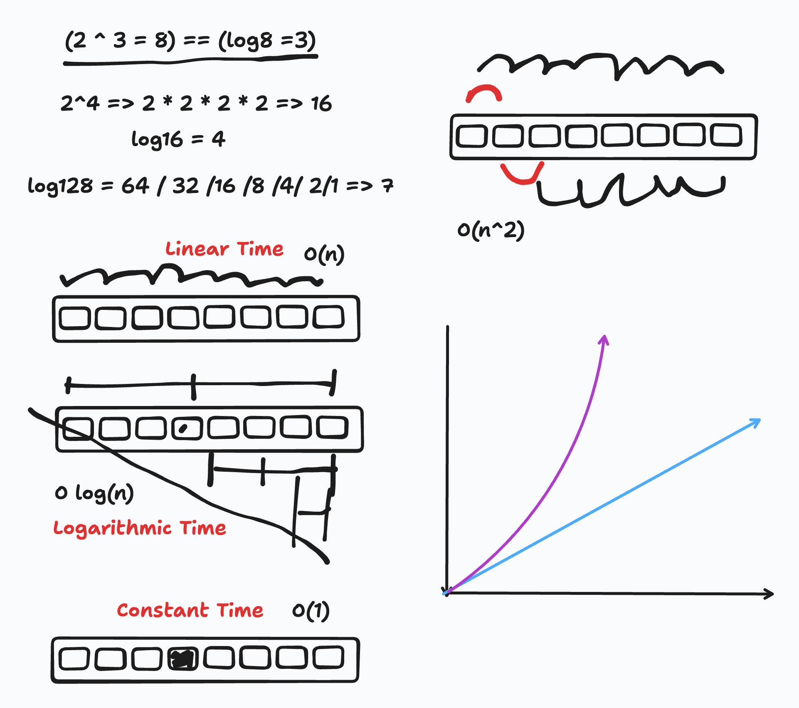

# Big-O

- What is big-o
- Determining big-o
- Linear vs Binary
- Identifying big-o
  - O(1)(cost is not tied with input size)
    - Algo is independent of the input size
    - It provides a fixed and consistent runtime for any input
  - O log(n)(Binary Search - Divide and Conquer)
    - efficient for large datasets
    - grows proportionally to the log of input size
  - O(n)(Linear Search - One for One)
    - Efficiency scales linearly with input size
    - Good for small lists
  - O(n^2) (Quadratic Time)
    - Efficiency squares the amount of input (input * input)
    - Performance suffers significantly as the input size increases
  - O (n log n) (Linearithmic Time)
    - Merges linear and logarithmic time
    - overkill if the dataset is not large enough

