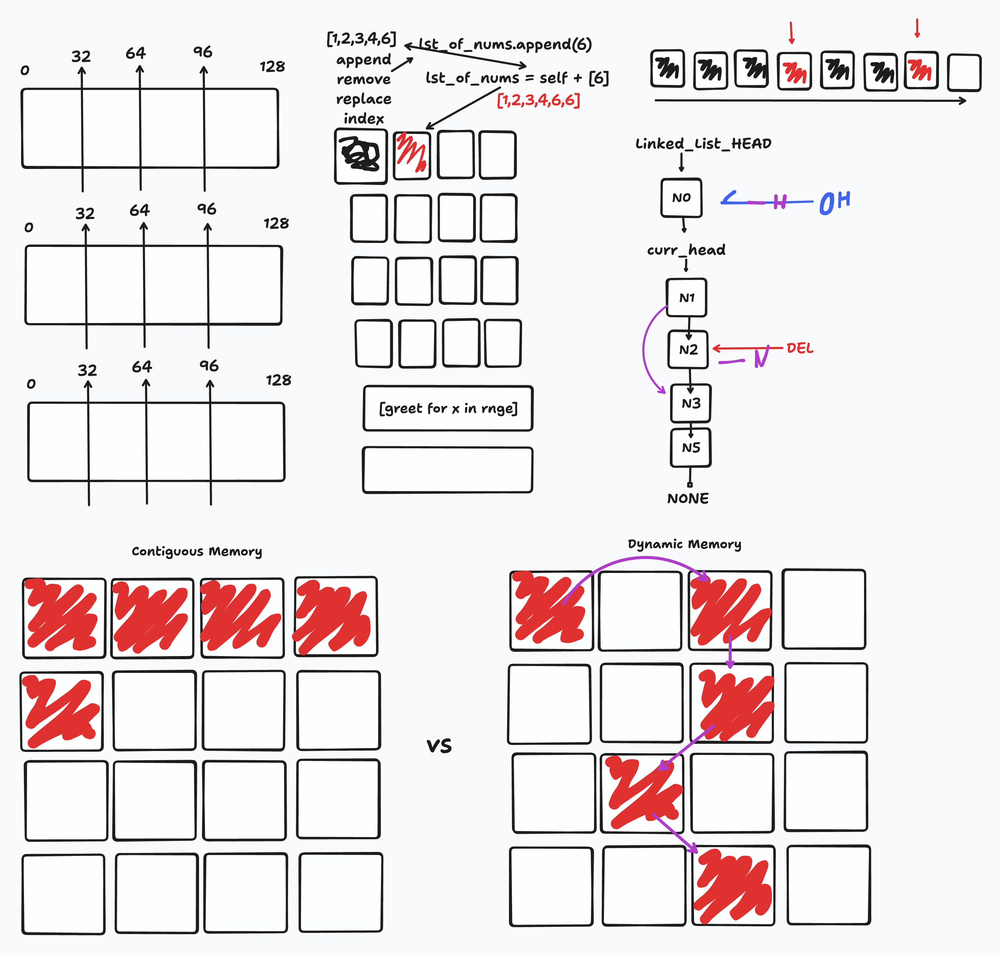

# Computer Memory & Linked List

## Computer Memory

- What is Computer Memory
- Why should I know Computer Memory
  - Resourcing optimization(right data structure for the right cost)
  - Prevent Memory Leaks(Unused memory used)
  - Performance Improvements(algos and ds implementation)
- What happens when I create a List(use ID & Hex to see location)
- Constructive vs Destructive (use ID & Hex to see location)
- List vs Tuples (sys.getsizeof)
- Efficient Code Example (list comprehension)

## Linked List

- What's wrong with lists?
- Linked Lists

