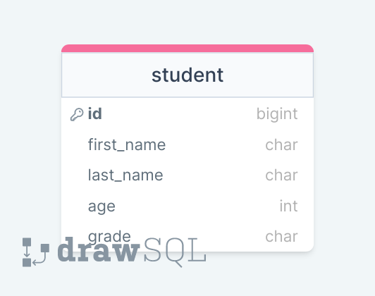
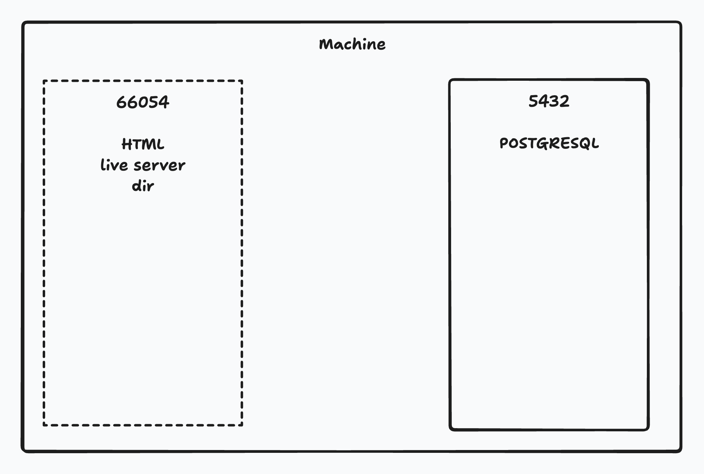

# RDBMS

- Why Databases
- Utilizing CSV with Python to retain Data
- Why use an RDBMS
- Working within postgresql
- Drawing tables in DrawSQL

- using sql files in PostgreSQL
- SQL queries
- Machine BreakDown

