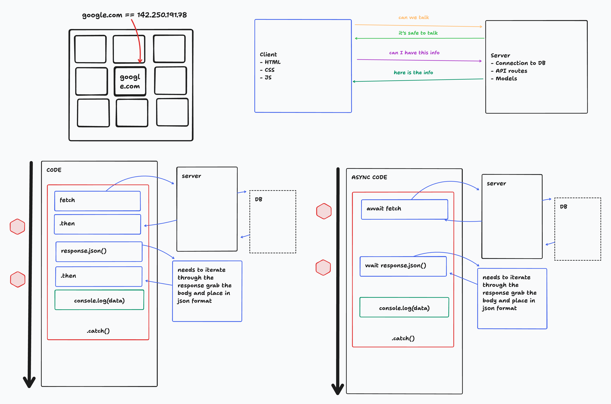

# HTTP & AJAX

- What is HTTP (nslookup)
- Client Server Conversation
- Example Requests
- Example Response
- The Network Tab
- Stateless
- Cookies
- BE overview
- Using Fetch to GET data
- Pending Requests and .then()
- Async Await Requests
- Handling CORS in Flask
- Manipulating the DOM
- Fetch and the PokeAPI
- Creating Img through the JS DOM

